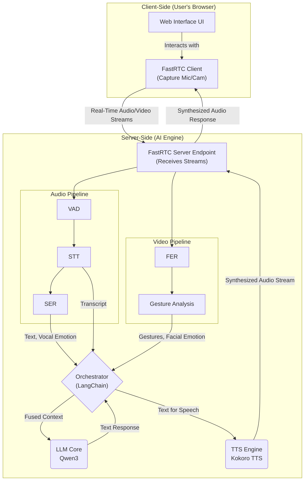

# Project Plan: AI Interviewer

**Version:** 1.0
**Date:** June 24, 2024

## Overview

This document outlines the comprehensive project plan, technical analysis, and development timeline for the "AI Interviewer" project. The primary goal is to develop a stable, real-time, multimodal interview prototype suitable for in-house testing and validation.

The system will be built upon an **"Integrated, High-Cohesion"** architecture, designed for parallel processing of data streams to ensure minimal latency and a holistic analysis of candidate communication.

This living document, maintained within the project's official GitHub repository, is intended to fulfill the initial planning requirements and serve as a foundational resource for current and future developers.

---

## Section 1: Technology and Resource Analysis

A thorough analysis of available open-source tools and frameworks has been conducted to select the optimal technology stack. The criteria for selection included performance, licensing (permissive licenses preferred), ease of local deployment, and community support.

The following tables detail the chosen components, the rationale for their selection, and the alternatives that were considered.

### 1.1 Multimodal Input Processing

#### Voice Activity Detection (VAD)

The ability to accurately detect speech from silence is the first critical step in the audio pipeline, enabling natural turn-taking and efficient processing.

| Component | Selected Tool | Key Features / Rationale | Alternatives Considered |
| :--- | :--- | :--- | :--- |
| **Voice Activity Detection (VAD)** | **Kyutai STT's `Semantic VAD`** | **Semantic Awareness:** Unlike traditional VADs that just detect sound, this model understands sentence structure, allowing it to capture complete thoughts even with pauses. This is crucial for natural conversation flow.    **Low Latency:** Optimized for streaming audio, which is essential for a real-time system.    **High Accuracy:** Proven to be robust in various acoustic environments. | `silero-vad`: A popular and lightweight alternative, but lacks semantic understanding.    `webrtcvad`: A common library, but can be overly aggressive in noisy environments and less accurate for nuanced conversation. |

#### Speech-to-Text (STT)

This component is responsible for transcribing the candidate's spoken words into text with high accuracy and low latency.

| Component | Selected Tool | Key Features / Rationale | Alternatives Considered |
| :--- | :--- | :--- | :--- |
| **Speech-to-Text (STT)** | **`Kyutai STT`** | **Streaming Native:** Designed from the ground up for real-time transcription, making it a perfect fit for our interactive system.    **High Accuracy & Throughput:** Achieves state-of-the-art accuracy (on par with non-streaming models like Whisper) while being able to handle many concurrent streams.    **Permissive License:** Open-source and suitable for commercial use. | `Whisper (OpenAI)`: Highly accurate, but not natively designed for streaming, requiring complex workarounds.    `NVIDIA NeMo`: A powerful toolkit, but can have a steeper learning curve and is more focused on training new models. |

#### Visual Analysis (Video Stream)

The video stream is analyzed to capture non-verbal cues, which are critical for a holistic understanding of the candidate's communication style.

| Component | Selected Tool | Key Features / Rationale | Alternatives Considered |
| :--- | :--- | :--- | :--- |
| **Facial Emotion Recognition (FER)** | **`EmotiEffLib`** | **Lightweight & Efficient:** Provides high-performance emotion recognition without requiring massive computational resources, making it ideal for real-time processing.    **Apache 2.0 License:** Permissive and well-suited for this project. | `DeepFace`: A comprehensive library but can be heavier and more complex to integrate for a simple real-time use case.    `fer (Python library)`: Easy to use but less performant than EmotiEffLib. |
| **Gesture & Body Language Analysis** | **`MediaPipe`** | **Industry Standard:** Google's framework for on-device ML is highly optimized for real-time performance on a variety of hardware.    **Rich Feature Set:** Provides detailed hand landmarks, pose estimation, and gesture recognition out-of-the-box. | `OpenPose`: A very powerful research tool, but generally requires more computational power and can be more complex to set up for deployment. |

#### Vocal Analysis (Audio Stream)

Beyond the words themselves, the *way* a candidate speaks provides valuable insight. This component analyzes the paralinguistic features of the audio.

| Component | Selected Tool | Key Features / Rationale | Alternatives Considered |
| :--- | :--- | :--- | :--- |
| **Vocal Emotion Recognition (SER)** | **`SenseVoice`** | **Unified Model:** Part of a larger voice understanding model that can perform multiple tasks (ASR, SER, etc.), leading to potentially better-integrated features.    **State-of-the-Art:** Built on modern architectures to accurately capture emotional tone from prosody. | `pyAudioAnalysis`: A good library for audio feature extraction, but requires building and training a custom classifier.    `librosa`: Excellent for audio analysis, but would also require a custom-trained model for emotion classification. |

### 1.2 Core Engine and Response Synthesis

#### Large Language Model (LLM)

The LLM serves as the "brain" of the interviewer, responsible for understanding the candidate's responses, asking relevant follow-up questions, and performing the final analysis. The selection is based on performance, licensing, and deployment feasibility as detailed in the project's primary technical report.

| Component | Selected Tool | Key Features / Rationale | Alternatives Considered |
| :--- | :--- | :--- | :--- |
| **Large Language Model (LLM)** | **`Qwen3` Series** | **Excellent Performance-to-Size Ratio:** As noted in the report, models like Qwen3-32B provide a strong balance of high performance and manageable deployment.    **Permissive Apache 2.0 License:** Ensures freedom for future modification and potential commercial use.    **State-of-the-Art Capabilities:** Top-tier results on relevant benchmarks for coding, math, and reasoning. | `Mistral`: A strong alternative with a permissive license, renowned for efficiency and reasoning in compact models.    `Llama 3`: Extremely powerful models, but larger versions are resource-intensive, making local deployment a challenge.    `Gemma 3`: While offering exceptional efficiency and multimodal capabilities, its restrictive custom Google license is noted as a **significant drawback** for the project's goals. |

#### Text-to-Speech (TTS)

To create a natural conversational experience, the AI's text-based responses must be synthesized into high-quality, low-latency audio.

| Component | Selected Tool | Key Features / Rationale | Alternatives Considered |
| :--- | :--- | :--- | :--- |
| **Text-to-Speech (TTS)** | **`Kokoro TTS`** | **High-Quality Voice:** Produces natural and realistic-sounding speech.    **Low Latency:** Optimized for real-time generation, which is critical for interactive applications.    **Permissive License:** Apache 2.0 license allows for broad use. | `Piper TTS`: A very strong and fast alternative, also optimized for local deployment on devices like the Raspberry Pi.    `Coqui TTS`: Historically a very popular choice, but recent licensing changes have made it less suitable for new commercial projects. |

### 1.3 System Orchestration

This component is the glue that connects all other modules, managing the flow of data and logic between the input processors, the LLM, and the response synthesizers.

| Component | Selected Tool | Key Features / Rationale | Alternatives Considered |
| :--- | :--- | :--- | :--- |
| **Orchestration Framework** | **`LangChain`** | **Mature & Feature-Rich:** Provides a robust set of tools, abstractions, and integrations specifically designed for building LLM-powered applications.    **Standardization:** Using a well-known framework makes the system easier for new developers to understand and maintain.    **Strong Community:** Large community means extensive documentation, tutorials, and support. | `LlamaIndex`: More heavily focused on Retrieval-Augmented Generation (RAG) and might be less flexible for our agent-like architecture.    **Custom Code (e.g., FastAPI/Flask):** Offers maximum flexibility but requires writing and maintaining significant boilerplate code for logic, state management, and tool integration. |

---

## Section 2: Proposed System Architecture

This section details the "Integrated, High-Cohesion" architecture of the AI Interviewer. The design prioritizes parallel processing of multiple data streams to ensure low latency and a holistic, real-time analysis of the candidate's verbal and non-verbal cues.

### 2.1 Architectural Flow

The system is logically divided into two main parts: a client-side interface running in the user's browser, and a server-side AI engine where the core processing occurs. The real-time communication between these two parts is handled by **FastRTC**, which manages the WebRTC data channels.

The end-to-end flow for a single interaction is as follows:

1.  **Client-Side Capture:** The user interacts with a web interface. The **FastRTC client library** captures audio and video from the user's microphone and camera.
2.  **Real-Time Transport:** FastRTC streams this data with low latency to the server-side AI engine via a secure WebRTC connection.
3.  **Server-Side Ingestion:** A **FastRTC Server Endpoint** receives the raw audio and video streams.
4.  **Parallel Processing:** The streams are passed to their respective processing pipelines:
    * **Audio Pipeline:** The audio stream is fed through the VAD, STT, and SER modules.
    * **Video Pipeline:** The video stream is simultaneously processed by the FER and Gesture Analysis modules.
5.  **Orchestration & Fusion:** The **LangChain Orchestrator** receives the structured outputs (e.g., text, emotions, gestures) from all pipelines.
6.  **Cognitive Core:** The orchestrator fuses this multimodal data into a comprehensive prompt for the **Qwen3 LLM**. The LLM analyzes the context and generates the AI interviewer's next response or question.
7.  **Response Synthesis:** The LLM's text response is sent to the **Kokoro TTS** module, which converts it into audio.
8.  **Response Delivery:** The synthesized audio is streamed back to the user's browser via the FastRTC connection, completing the conversational loop.

### 2.2 System Diagram

The following diagram illustrates the flow of data and the interaction between the system's components.

---

## Section 3: Detailed Project Timeline

This section outlines the proposed development plan as an actionable checklist.

*Disclaimer: These durations are high-level estimates and may be subject to change based on development complexity and testing outcomes.*

- [ ] **Phase 1: Planning & Setup** (3 Days)
    - [ ] Finalize project plan and technical documentation (this `README.md`).
    - [ ] Initialize Git repository.
    - [ ] Set up development environments (Docker, Conda).
    > **Deliverable:** A finalized and approved `README.md` document in the main branch of the project repository.

- [ ] **Phase 2: Backend & Communication Layer** (1 Week)
    - [ ] Set up a basic server (e.g., using FastAPI).
    - [ ] Implement the FastRTC server endpoint to receive audio/video streams.
    - [ ] Create a basic test client to send a stream to the server.
    > **Deliverable:** A functioning server that can successfully receive a WebRTC stream from a client.

- [ ] **Phase 3: Initial Pipeline Integration** (2 Weeks)
    - [ ] Integrate the **Audio Pipeline**: Connect the server endpoint to the VAD, STT, and SER modules.
    - [ ] Integrate the **Video Pipeline**: Connect the server endpoint to the FER and Gesture Analysis modules.
    > **Deliverable:** Backend services that can process incoming streams and log the outputs (text, emotions, etc.) to the console.

- [ ] **Phase 4: Core Engine Integration** (2 Weeks)
    - [ ] Set up the LangChain orchestrator.
    - [ ] Connect the outputs of the audio/video pipelines to the orchestrator.
    - [ ] Integrate the Qwen3 LLM to receive context from the orchestrator and generate a text response.
    > **Deliverable:** A system where the LLM receives fused data from the pipelines and generates a relevant text-based response.

- [ ] **Phase 5: End-to-End System & UI** (2 Weeks)
    - [ ] Integrate the Kokoro TTS engine to synthesize the LLM's response.
    - [ ] Complete the response loop by sending the synthesized audio back to the client via FastRTC.
    - [ ] Develop a minimal "proof-of-concept" web UI for interaction.
    > **Deliverable:** A fully functional end-to-end prototype where a user can speak and receive a spoken response from the AI.

- [ ] **Phase 6: Testing & Documentation** (1 Week)
    - [ ] Conduct internal testing and bug fixing.
    - [ ] Refine and add to the technical documentation (e.g., API usage, setup instructions).
    - [ ] Prepare a final project demonstration and report.
    > **Deliverable:** A stable prototype, comprehensive documentation, and a final presentation.

---

### **Revised Submission Deadline**

Based on the detailed task breakdown above, the proposed submission deadline for the fully functional prototype is **9 weeks** from the project start date.