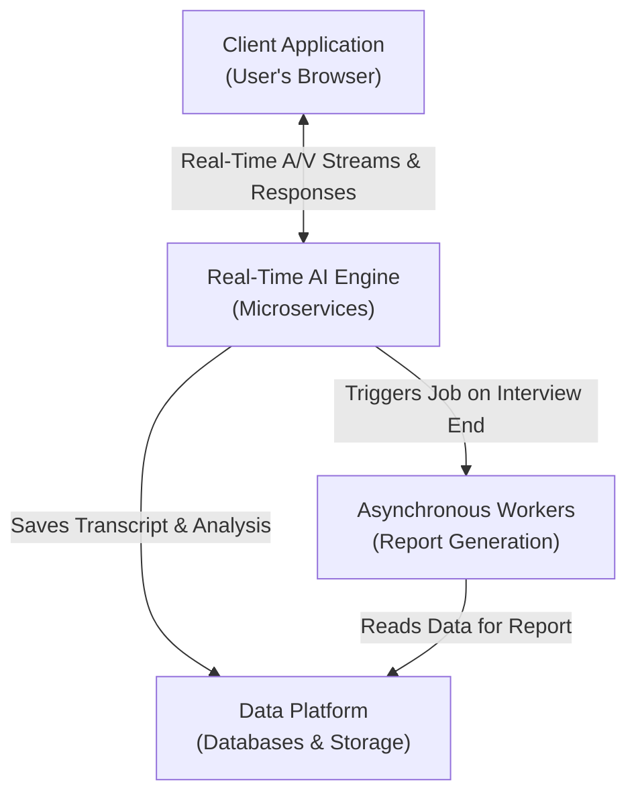
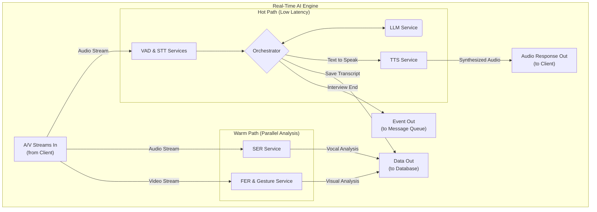
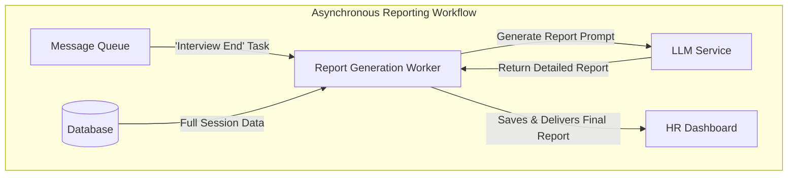

# Project Plan: AI Interviewer (v2.0)

**Version:** 2.0
**Date:** June 25, 2025

## Overview

This document outlines the comprehensive project plan, technical analysis, and development timeline for the "AI Interviewer" project. The primary goal is to develop a stable, **modular, and production-ready** prototype suitable for in-house testing and validation.

The system will be built upon a **"Two-Speed" Microservices Architecture**, designed to provide a low-latency conversational experience while performing rich data analysis in parallel. This document serves as the foundational resource for development.

---
### Table of Contents

- [Project Plan: AI Interviewer (v2.0)](#project-plan-ai-interviewer-v20)
  - [Overview](#overview)
    - [Table of Contents](#table-of-contents)
  - [Section 1: Technology and Resource Analysis](#section-1-technology-and-resource-analysis)
    - [1.1 Multimodal Input Processing](#11-multimodal-input-processing)
      - [Voice Activity Detection (VAD)](#voice-activity-detection-vad)
      - [Speech-to-Text (STT)](#speech-to-text-stt)
      - [Visual Analysis (Video Stream)](#visual-analysis-video-stream)
      - [Vocal Analysis (Audio Stream)](#vocal-analysis-audio-stream)
    - [1.2 Core Engine and Response Synthesis](#12-core-engine-and-response-synthesis)
      - [Large Language Model (LLM)](#large-language-model-llm)
      - [Text-to-Speech (TTS)](#text-to-speech-tts)
    - [1.3 Infrastructure and Orchestration](#13-infrastructure-and-orchestration)
  - [Section 2: Proposed System Architecture](#section-2-proposed-system-architecture)
    - [2.1 Architectural Flow: The Story of an Interview](#21-architectural-flow-the-story-of-an-interview)
    - [2.2 System Diagrams](#22-system-diagrams)
      - [Diagram 2.2.1: High-Level System Overview](#diagram-221-high-level-system-overview)
      - [Diagram 2.2.2: The Real-Time AI Engine (Detailed View)](#diagram-222-the-real-time-ai-engine-detailed-view)
      - [Diagram 2.2.3: Asynchronous Reporting Workflow](#diagram-223-asynchronous-reporting-workflow)
  - [Section 3: A Phased Plan for Development](#section-3-a-phased-plan-for-development)
    - [**Revised Submission Deadline**](#revised-submission-deadline)

---

## Section 1: Technology and Resource Analysis

A thorough analysis of available tools was conducted. The following tables detail the chosen components for the AI modules and the necessary supporting infrastructure.

### 1.1 Multimodal Input Processing

#### Voice Activity Detection (VAD)

The ability to accurately detect speech from silence is the first critical step in the audio pipeline, enabling natural turn-taking and efficient processing.

| Component | Selected Tool | Key Features / Rationale | Alternatives Considered |
| :--- | :--- | :--- | :--- |
| **Voice Activity Detection (VAD)** | **Kyutai STT's `Semantic VAD`** | **Semantic Awareness:** Unlike traditional VADs that just detect sound, this model understands sentence structure, allowing it to capture complete thoughts even with pauses. This is crucial for natural conversation flow.    **Low Latency:** Optimized for streaming audio, which is essential for a real-time system.    **High Accuracy:** Proven to be robust in various acoustic environments. | `silero-vad`: A popular and lightweight alternative, but lacks semantic understanding.    `webrtcvad`: A common library, but can be overly aggressive in noisy environments and less accurate for nuanced conversation. |

#### Speech-to-Text (STT)

This component is responsible for transcribing the candidate's spoken words into text with high accuracy and low latency.

| Component | Selected Tool | Key Features / Rationale | Alternatives Considered |
| :--- | :--- | :--- | :--- |
| **Speech-to-Text (STT)** | **`Kyutai STT`** | **Streaming Native:** Designed from the ground up for real-time transcription, making it a perfect fit for our interactive system.    **High Accuracy & Throughput:** Achieves state-of-the-art accuracy (on par with non-streaming models like Whisper) while being able to handle many concurrent streams.    **Permissive License:** Open-source and suitable for commercial use. | `Whisper (OpenAI)`: Highly accurate, but not natively designed for streaming, requiring complex workarounds.    `NVIDIA NeMo`: A powerful toolkit, but can have a steeper learning curve and is more focused on training new models. |

#### Visual Analysis (Video Stream)

The video stream is analyzed to capture non-verbal cues, which are critical for a holistic understanding of the candidate's communication style.

| Component | Selected Tool | Key Features / Rationale | Alternatives Considered |
| :--- | :--- | :--- | :--- |
| **Facial Emotion Recognition (FER)** | **`EmotiEffLib`** | **Lightweight & Efficient:** Provides high-performance emotion recognition without requiring massive computational resources, making it ideal for real-time processing.    **Apache 2.0 License:** Permissive and well-suited for this project. | `DeepFace`: A comprehensive library but can be heavier and more complex to integrate for a simple real-time use case.    `fer (Python library)`: Easy to use but less performant than EmotiEffLib. |
| **Gesture & Body Language Analysis** | **`MediaPipe`** | **Industry Standard:** Google's framework for on-device ML is highly optimized for real-time performance on a variety of hardware.    **Rich Feature Set:** Provides detailed hand landmarks, pose estimation, and gesture recognition out-of-the-box. | `OpenPose`: A very powerful research tool, but generally requires more computational power and can be more complex to set up for deployment. |

#### Vocal Analysis (Audio Stream)

Beyond the words themselves, the *way* a candidate speaks provides valuable insight. This component analyzes the paralinguistic features of the audio.

| Component | Selected Tool | Key Features / Rationale | Alternatives Considered |
| :--- | :--- | :--- | :--- |
| **Vocal Emotion Recognition (SER)** | **`SenseVoice`** | **Unified Model:** Part of a larger voice understanding model that can perform multiple tasks (ASR, SER, etc.), leading to potentially better-integrated features.    **State-of-the-Art:** Built on modern architectures to accurately capture emotional tone from prosody. | `pyAudioAnalysis`: A good library for audio feature extraction, but requires building and training a custom classifier.    `librosa`: Excellent for audio analysis, but would also require a custom-trained model for emotion classification. |

### 1.2 Core Engine and Response Synthesis

#### Large Language Model (LLM)

The LLM serves as the "brain" of the interviewer, responsible for understanding the candidate's responses, asking relevant follow-up questions, and performing the final analysis. The selection is based on performance, licensing, and deployment feasibility as detailed in the project's primary technical report.

| Component | Selected Tool | Key Features / Rationale | Alternatives Considered |
| :--- | :--- | :--- | :--- |
| **Large Language Model (LLM)** | **`Qwen3` Series** | **Excellent Performance-to-Size Ratio:** As noted in the report, models like Qwen3-32B provide a strong balance of high performance and manageable deployment.    **Permissive Apache 2.0 License:** Ensures freedom for future modification and potential commercial use.    **State-of-the-Art Capabilities:** Top-tier results on relevant benchmarks for coding, math, and reasoning. | `Mistral`: A strong alternative with a permissive license, renowned for efficiency and reasoning in compact models.    `Llama 3`: Extremely powerful models, but larger versions are resource-intensive, making local deployment a challenge.    `Gemma 3`: While offering exceptional efficiency and multimodal capabilities, its restrictive custom Google license is noted as a **significant drawback** for the project's goals. |

#### Text-to-Speech (TTS)

To create a natural conversational experience, the AI's text-based responses must be synthesized into high-quality, low-latency audio.

| Component | Selected Tool | Key Features / Rationale | Alternatives Considered |
| :--- | :--- | :--- | :--- |
| **Text-to-Speech (TTS)** | **`Kokoro TTS`** | **High-Quality Voice:** Produces natural and realistic-sounding speech.    **Low Latency:** Optimized for real-time generation, which is critical for interactive applications.    **Permissive License:** Apache 2.0 license allows for broad use. | `Piper TTS`: A very strong and fast alternative, also optimized for local deployment on devices like the Raspberry Pi.    `Coqui TTS`: Historically a very popular choice, but recent licensing changes have made it less suitable for new commercial projects. |

### 1.3 Infrastructure and Orchestration

To support a modular and scalable system, the following infrastructure components have been selected.

| Component | Selected Tool | Key Features / Rationale | Alternatives Considered |
| :--- | :--- | :--- | :--- |
| **Containerization** | **`Docker`** | **Industry Standard:** Provides OS-level virtualization to package each microservice and its dependencies into isolated containers.    **Portability & Scalability:** Ensures consistency from development to production and simplifies scaling individual services. | `Podman`: A daemonless alternative to Docker.    Virtual Machines: Heavier and less efficient for microservice architectures. |
| **Real-Time Communication** | **`FastRTC`** | **High-Level Abstraction:** As specified in project research, this provides a simplified API over WebRTC for real-time audio/video streaming. | `aiortc`: A lower-level Python library for WebRTC, offering more control but requiring more implementation effort. |
| **System Orchestration** | **`LangChain`** | **LLM-Native Framework:** Provides a robust set of tools and abstractions designed for building complex, agent-like applications that connect LLMs to other services.    **Standardization:** Using a well-known framework makes the system easier to maintain. | `LlamaIndex`: A strong alternative specializing in Retrieval-Augmented Generation (RAG).    `Custom Code (FastAPI)`: Offers maximum flexibility but requires significant boilerplate code. |
| **Operational Database** | **`PostgreSQL`** | **Reliability & Structure:** A powerful, open-source relational database ideal for storing structured data like interview metadata, transcripts, and analysis results.    **JSONB Support:** Excellent support for storing semi-structured JSON data from AI models within a relational structure. | `MongoDB`: A NoSQL option that offers more flexibility for unstructured data but can be less ideal for relational queries between interviews and users. |
| **Vector Database** | **`ChromaDB`** | **AI-Native & Python-Friendly:** An open-source vector database designed to be simple to use within Python applications for storing and searching embeddings. Essential for future semantic search capabilities. | `Qdrant`: A more feature-rich and performant vector database, written in Rust.    `Pinecone`: A popular managed (cloud) vector database. |
| **File / Object Storage** | **`MinIO`** | **S3-Compatible & Self-Hosted:** An open-source object storage server that is fully compatible with the Amazon S3 API. Ideal for storing large binary files (raw audio/video) locally and is the best practice for production systems. | `Amazon S3`: The leading cloud object storage service.    `Local Filesystem`: Simple for a prototype but not scalable or suitable for production. |
| **Asynchronous Task Queue** | **`Celery` with `RabbitMQ`** | **Robust & Scalable:** The industry-standard combination in the Python ecosystem for managing background tasks.    **Resilience:** RabbitMQ is a powerful message broker that ensures task delivery. Celery provides the framework for defining and running the tasks (like our report generator). | `Redis` (as a broker): Simpler to set up than RabbitMQ but less feature-rich for complex routing.    `Dramatiq`: A simpler alternative to Celery. |

---

## Section 2: Proposed System Architecture

The system is designed as a **"Two-Speed" Microservices Architecture** to balance the demands of real-time conversation with thorough, parallel data analysis. This modular approach ensures low conversational latency for the candidate while capturing rich data for a comprehensive, automated report for HR.

The architecture is composed of four primary logical areas:
1.  **The Client Application:** The user-facing web interface.
2.  **The Real-Time AI Engine:** A collection of microservices that handle the live interview.
3.  **The Data Platform:** The central repository for all stored data, including transcripts, analysis, and raw media files.
4.  **Asynchronous Workers:** Background processes that handle non-time-critical tasks like generating the final report.

### 2.1 Architectural Flow: The Story of an Interview

To understand how these parts work together, let's follow the journey of a single interview from start to finish.

1.  **The Interview Begins:** A candidate joins the interview via the web interface. Their browser, using the **FastRTC** library, establishes a secure, real-time connection to our server and begins streaming their audio and video.

2.  **The Real-Time Conversation (The "Hot Path"):** The AI engine immediately begins processing the audio stream on its lowest-latency path. The `VAD` service detects speech, which is instantly transcribed by the `STT` service. The `Orchestrator` receives the text, sends it to the `LLM` for a quick conversational response, and the `TTS` service speaks the AI's reply back to the candidate. This entire loop is optimized to feel like a natural conversation.

3.  **Parallel Analysis (The "Warm Path"):** Simultaneously, the raw audio and video streams are being processed on a separate, parallel path. The `SER`, `FER`, and `Gesture Analysis` services are continuously analyzing the streams. They don't need to finish in real-time; their job is to tag moments with rich data (e.g., "sentiment: joy at timestamp 02:15") and save this analysis to the **Database**, perfectly synchronized with the transcript from the Hot Path.

4.  **The Interview Concludes:** When the interview ends, the `Orchestrator` publishes an `interview_completed` event to the **Message Queue** and saves the raw audio/video files to **Object Storage**.

5.  **Asynchronous Reporting:** An **Asynchronous Worker**, which is always listening for `interview_completed` events, picks up the task. It queries the **Database** to retrieve the full transcript and all the associated multimodal analysis for the session. It then uses the **LLM** in a more powerful, analytical mode to generate the final, detailed candidate report and delivers it to HR.

### 2.2 System Diagrams

To visualize this architecture clearly without being overwhelming, we'll use a series of diagrams, from a high-level overview to more detailed component views.

#### Diagram 2.2.1: High-Level System Overview

This diagram shows the four main logical areas of our system and how they interact. It provides the "at a glance" view.

#### Diagram 2.2.2: The Real-Time AI Engine (Detailed View)

This diagram "zooms in" on the Real-Time AI Engine, showing the Hot and Warm paths working in parallel.

#### Diagram 2.2.3: Asynchronous Reporting Workflow

This final diagram illustrates the simple, robust process for generating the final report after the interview is over.

---

## Section 3: A Phased Plan for Development

- [ ] **Phase 1: Blueprint and Foundation (1 Week)**
    - **Goal:** To finalize the complete architectural design and prepare the project groundwork.
    - [ ] Finalize this project plan document, ensuring all stakeholders are in agreement.
    - [ ] Establish the project's code repository with best practices for version control.
    - [ ] Design the official "communication rules" (the API specifications) that will allow all of the system's independent components to talk to each other flawlessly.
    - [ ] Prepare the local development environment so work can begin smoothly.
    > **Deliverable:** A complete and approved project blueprint and a ready-to-use development environment.

- [ ] **Phase 2: Building the Core Conversation Engine (2 Weeks)**
    - **Goal:** To bring the AI's basic conversational ability to life.
    - [ ] Construct the core service that listens for the candidate's speech and transcribes it into text (the "ears" of the system).
    - [ ] Construct the service that takes text and synthesizes it into natural-sounding speech (the "voice" of the system).
    - [ ] Develop the central "brain" (the Orchestrator) that connects these two services to the Large Language Model, enabling a basic voice-in, voice-out conversation.
    > **Deliverable:** A functional "chatbot" skeleton that proves the fundamental conversational loop works.

- [ ] **Phase 3: Developing the Analytical Senses (1.5 Weeks)**
    - **Goal:** To build the components that analyze the rich, non-verbal data happening in parallel to the conversation.
    - [ ] Construct the services that analyze facial expressions, gestures, and the emotional tone of the candidate's voice.
    - [ ] Build the system's "memory" by setting up the databases and storage for all transcripts, analysis data, and media files.
    - [ ] Connect these analytical services to the database, ensuring all insights are saved with precise timestamps.
    > **Deliverable:** A system that can "watch" and "listen" to an interview, capturing and storing all the nuanced data it perceives.

- [ ] **Phase 4: Assembling the Full System (1.5 Weeks)**
    - **Goal:** To integrate all individual components into a single, cohesive application and build the user interface.
    - [ ] Develop the simple and clean web interface where the candidate will conduct their interview.
    - [ ] Connect the frontend UI to the backend engine, establishing the real-time video and audio stream.
    - [ ] Build the automated reporting system that activates after an interview, gathering all the stored data to generate a comprehensive candidate report.
    > **Deliverable:** A fully integrated prototype. A user can complete an end-to-end interview via the UI, and a report will be generated for HR.

- [ ] **Phase 5: Final Polish and Handoff (1 Week)**
    - **Goal:** To ensure the prototype is stable, reliable, and ready for demonstration.
    - [ ] Conduct thorough testing of the complete system to find and fix any remaining bugs.
    * [ ] Write clear documentation on how to set up, run, and use the application.
    - [ ] Prepare and rehearse a final presentation to showcase the project's success.
    > **Deliverable:** A stable, documented, and impressive prototype ready for its final demonstration.

---

### **Revised Submission Deadline**

Based on this plan, the proposed submission deadline for the fully functional prototype is **7 weeks** from the project start date.